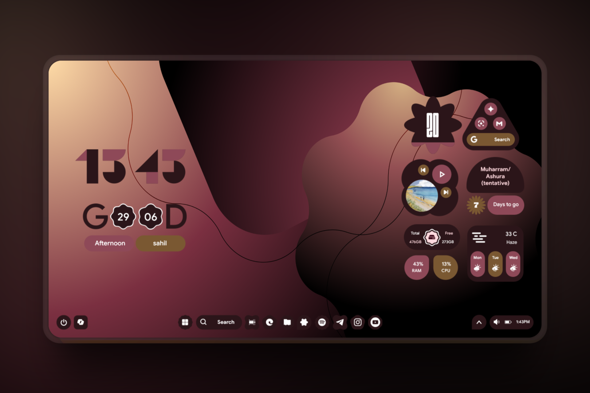
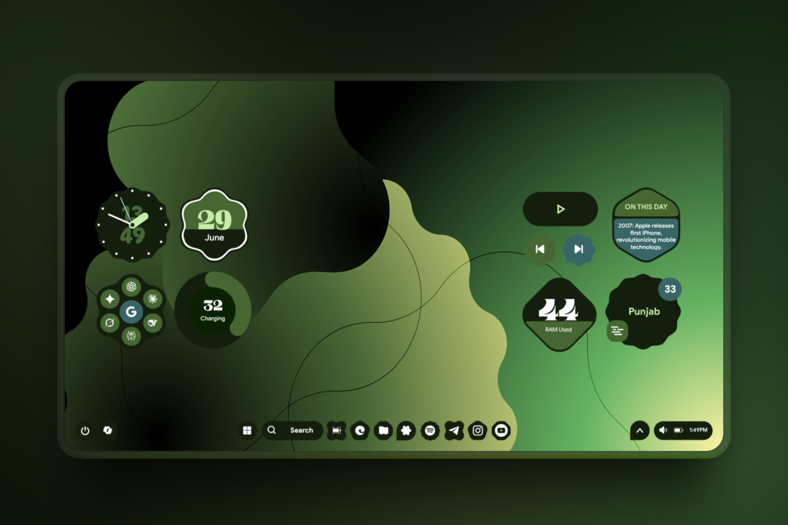
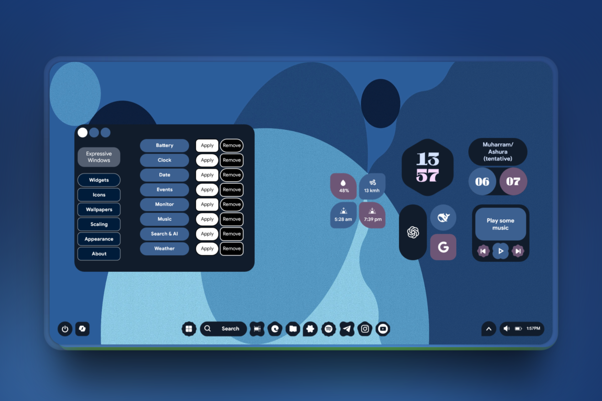

 <h1 align="center">Expressive Windows</h1>

  A rainmeter based project featuring Material 3 expressive widgets for your Windows desktops. Works on WIndows 7 and above. 

<h3 align="center">

  
  
  
 

# Features of NThing UI

- 3 styles for clock widget
- 3 styles for date widget
- 3 styles for battery widget
- 3 styles for events widget
- 3 styles for music widget
- 3 styles for monitor widget
- 3 styles for search/AI widget
- 3 styles for weather widget.
- New Expressive color scheme, only works with light mode.
- inspired from Material 3 expressive UI
- dark-light mode switch to easily change between 2 modes. 
- 5 different scaling options for resizing widgets. 

# Screenshots

  
  
  

# Installation

1. Install/ Update [Rainmeter for Windows](https://www.rainmeter.net/).
2. Download the [latest release of NThing UI](https://github.com/Runixe786/Expressive-Windows/releases/latest).
3. Double click the downloaded `.rmskin` file and it should open the skin install dialog.
   > If you have a portable Rainmeter install, your file may not open by default by the skin installer. If so, open the `.rmskin` file with the `SkinInstaller.exe` file in the Rainmeter install directory. 
   > 

4. Continue with on screen options and you are done! In case your skin didn't load on install, open Rainmeter skin manager and manually load the skin and layouts.
   > 

# Credits
1. [Gadgets by SilverAzide](https://github.com/SilverAzide/Gadgets) for Weather widgets.
2. Rainmeter forum community to help fix some issues.
3. A bit of google and AI for ideas and suggestions.
4. All testers for early testing of beta version.

# Feedback 
Since this project is still in beta, its expected to have bugs. If you find any, Please report me or if you want to add suggestions, open a new [issue](https://github.com/Runixe786/Expressive-Windows/issues/new) or text me in Telegram [@MaybeSahil](https://t.me/MaybeSahil)

**Do star this repo to show your support and share as well, means a lot**. Thanks, see yaa 💝

	

